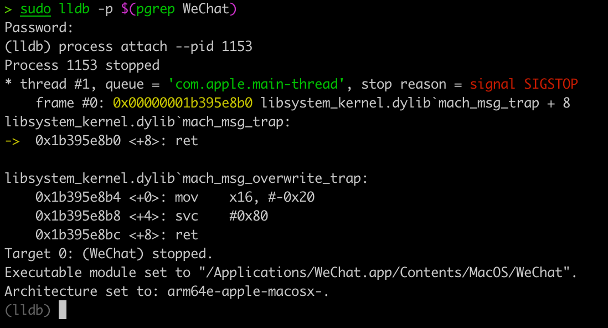
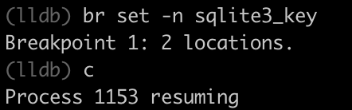
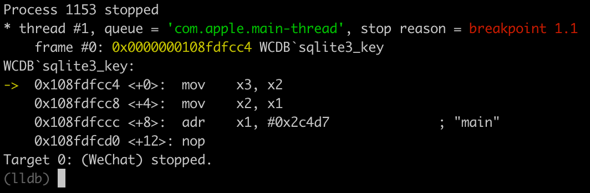
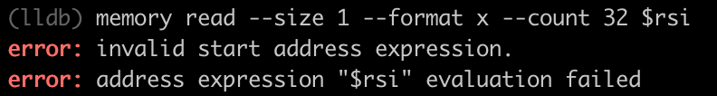
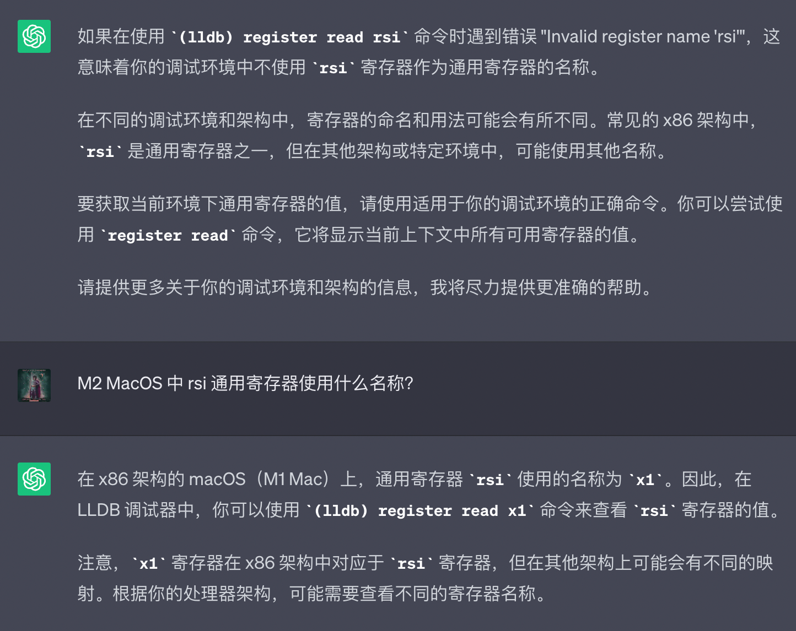
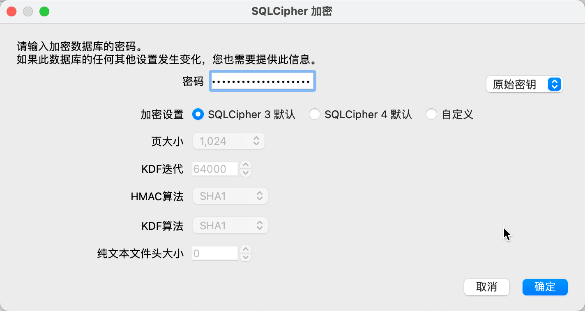
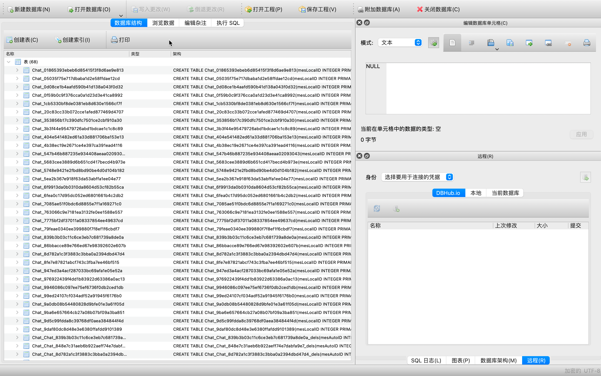

# 20230626-Mac 导出微信聊天记录

## 聊天记录位置

```Shell
~/Library/Containers/com.tencent.xinWeChat/Data/Library/Application\ Support/com.tencent.xinWeChat/xxx/yyy/Message/*.db
```

```Shell
/Users/kevin/Library/Containers/com.tencent.xinWeChat/Data/Library/Application\ Support/com.tencent.xinWeChat/2.0b4.0.9/aaf3c93cbce3b46d9b1f46752ddd7d38/Message
```

如果多个账号，可以使用命令`ls -lth`查看最近的是哪个。





这时候会弹出微信登录界面，登陆就行了。登陆后可能会卡住，进不去微信，但不用管，继续下面的操作。



继续在 lldb 的子 shell 中输入 memory read --size 1 --format x --count 32 $rsi，这时会输出类似如下信息：



⚠️ 备注：笔者用的是 M2 MacOS 笔记本，执行`memory read --size 1 --format x --count 32 $rsi`报错，通过询问 ChatGPT 获得解决方案 `memory read --size 1 --format x --count 32 $x1`。



```Shell
0x60000b834ac0: 0xf8 0xdf 0x05 0x0a 0xd2 0x08 0x47 0xdf
0x60000b834ac8: 0xa0 0x1c 0xe4 0xde 0x5c 0x83 0xa8 0x11
0x60000b834ad0: 0xa4 0x1f 0x34 0x25 0xdf 0x15 0x40 0x45
0x60000b834ad8: 0xba 0xa2 0x36 0x72 0x49 0x7f 0xeb 0xf5
```

用 Python 对上一步得到的数据进行处理，具体代码如下：

```Python
source = """
0x60000b834ac0: 0xf8 0xdf 0x05 0x0a 0xd2 0x08 0x47 0xdf
0x60000b834ac8: 0xa0 0x1c 0xe4 0xde 0x5c 0x83 0xa8 0x11
0x60000b834ad0: 0xa4 0x1f 0x34 0x25 0xdf 0x15 0x40 0x45
0x60000b834ad8: 0xba 0xa2 0x36 0x72 0x49 0x7f 0xeb 0xf5
"""
key = '0x' + ''.join(i.partition(':')[2].replace('0x', '').replace(' ', '') for i in source.split('\n')[1:5])
print(key)

# 输出为：0xf8df050ad20847dfa01ce4de5c83a811a41f3425df154045baa23672497febf5

```

从 https://sqlitebrowser.org/ 下载 Mac 版本的 DB Browser for SQLite 并安装。

找到数据库文件位置，可以 cd 到目录下(主要`*`替换为自己目录)，用`open .`快速打开访达，在选中用数据库软件打开。

```Shell
cd ~/Library/Containers/com.tencent.xinWeChat/Data/Library/Application\ Support/com.tencent.xinWeChat/*/*/Message/*.db
```



打开数据库后，可以看到有 200 多张表格，每张表格就是你和一个人的单聊记录或者一个群组的聊天记录。



## 参考

1. 【超简单|超详细】Mac 导出和备份微信聊天记录|破解数据库|生成聊天词云图 | 根据日期、对象等全局查询 https://ferryxie.com/archives/4176
2. 超简单：mac 导出微信聊天记录（附上粉丝群全部聊天记录） https://developer.aliyun.com/article/978379
3. 解密保存 Mac 版微信聊天记录的数据库文件并导出聊天记录 https://blog.csdn.net/swinfans/article/details/88712593
4. 用 10 万条微信聊天记录和 280 篇博客文章，我克隆了一个数字版自己 https://sspai.com/post/79230
