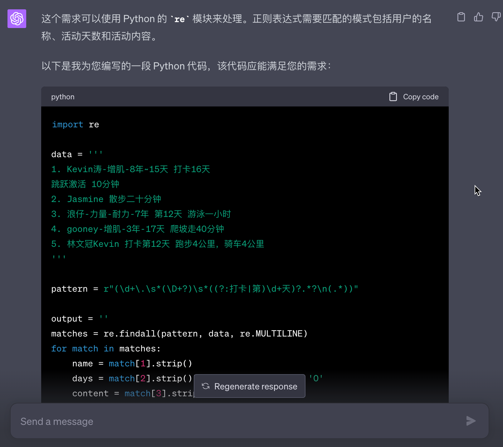

# CDDR

You

---

请你担任 Python 技术专家，你能根据我提供的要求，给我写一个统计脚本吗？

提供的数据在一个文件`exercise_input_2023-06.txt`中，数据格式如下：
'''
6 月 22 日打卡

1. 浪仔-力量-耐力-7 年 打卡 13 天 羽毛球 🏸️2 小时
2. 林文冠 Kevin 第 12 天 跑步 4 公里，骑车 4 公里

---

6 月 21 日打卡 伙伴们加油 💪🏻
例 打卡第 X 天
训练部位：训练动作 训练时长
（可选：饮食、睡眠记录
（可选：其他心得分享

1. Kevin 涛-增肌-8 年~15 天 打卡 16 天
   跳跃激活 10 分钟
2. Jasmine 打卡 11 天 散步二十分钟
3. 浪仔-力量-耐力-7 年 打卡 12 天 游泳一小时
4. gooney-增肌-3 年-17 天 爬坡走 40 分钟

---

6 月 20 日打卡 伙伴们加油 💪🏻
例 打卡第 X 天
训练部位：训练动作 训练时长
（可选：饮食、睡眠记录
（可选：其他心得分享

1. Kevin 涛-增肌-8 年~14 天 打卡 15 天
   跳跃激活 10 分钟（早起犯困就跳跳）
   胸部：俯卧撑 100 个
2. Jasmine 打卡第十天 快走 20 分钟
3. gooney-增肌-3 年-16 天 打卡 第 16 天 胸部训练 50 分钟 ➕ 爬坡走 30 分钟

---

6 月 19 日打卡 伙伴们加油 💪🏻
例 打卡第 X 天
训练部位：训练动作 训练时长
（可选：饮食、睡眠记录
（可选：其他心得分享

1. Kevin 涛-增肌-8 年~13 天 打卡 14 天
   全身：跳跃激活 5 分钟
   肩部：倒立俯卧撑练习 10 分钟

---

6 月 17 日打卡 伙伴们加油 💪🏻
例 打卡第 X 天
训练部位：训练动作 训练时长
（可选：饮食、睡眠记录
（可选：其他心得分享 3. 浪仔-力量-耐力-7 年 打卡第 10 天 羽毛球 🏸️ 两小时。俯卧撑 60
'''

需要的统计数据格式如下，并按照`本月累计打卡天数`排序（从大到小）将数据输入到一个文件`exercise_output_2023-06.txt`中。
'''

### 昵称（本月累计打卡 X 天）

#### 日期

运动内容
'''

---

You

---

在 MacOS Vscode 中如何 debug 调式 exercise_stats.py

---

You

---

解释代码：

# 使用正则表达式提取每个打卡记录的日期和详细内容

records = re.findall(r"\n(\d+月\d+日打卡.\*?)\n---", content, re.DOTALL)
print("records:{}".format(records))

---

You

---

提供的数据在一个文件`exercise_input_2023-06.txt`中，数据格式如下：

```
---

6月22日打卡

1. 浪仔-力量-耐力-7年  打卡13天 羽毛球🏸️2小时
2. 林文冠Kevin 第12天 跑步4公里，骑车4公里

---

6月21日打卡 伙伴们加油💪🏻
例 打卡第X天
训练部位：训练动作 训练时长
（可选：饮食、睡眠记录
（可选：其他心得分享

1. Kevin涛-增肌-8年~15天 打卡16天
跳跃激活 10分钟
2. Jasmine 打卡11天 散步二十分钟
3. 浪仔-力量-耐力-7年 打卡12天 游泳一小时
4. gooney-增肌-3年-17天 爬坡走40分钟

---

6月20日打卡 伙伴们加油💪🏻
例 打卡第X天
训练部位：训练动作 训练时长
（可选：饮食、睡眠记录
（可选：其他心得分享

1. Kevin涛-增肌-8年~14天 打卡15天
跳跃激活10分钟（早起犯困就跳跳）
胸部：俯卧撑100个
2. Jasmine 打卡第十天 快走20分钟
3. gooney-增肌-3年-16天 打卡 第16天  胸部训练50分钟 ➕爬坡走30分钟

---
```

需要的统计数据格式如下，并按照`本月累计打卡天数`排序（从大到小）将数据输入到一个文件`exercise_output_2023-06.txt`中。

```

### 昵称（本月累计打卡 X 天）

#### 日期

运动内容
```

备注：输入数据`exercise_input_2023-06.txt`中的内容格式可能不一致，有可能是“打卡X天”或者“打卡第X天”或者其他，但是每个序号都是一个人的打卡记录，统计结果数据要保证不遗漏！

你能根据我提供的要求，给我写一个 Python 统计脚本吗？

---


---


请你担任 Python 技术专家，你能根据我的需求，给我写一个 re 正则表达式吗？
每一条数据都在`.`序号后，格式一般为
```
1. {name} {days}
{content}
2. {name} {days} {content}
3. {name} {content}
```，
请获取出{name} {days}（如果有的话） {content}。

示例数据如下：
```
1. Kevin涛-增肌-8年~15天 打卡16天
跳跃激活 10分钟
2. Jasmine 散步二十分钟
3. 浪仔-力量-耐力-7年 第12天 游泳一小时
4. gooney-增肌-3年-17天 爬坡走40分钟
5. 林文冠Kevin 打卡第12天 跑步4公里，骑车4公里
```

---

---

写一个正则匹配出{x月x日}，示例数据如下：
```

6月22日打卡

1. 浪仔-力量-耐力-7年  打卡13天 羽毛球🏸️2小时
2. 林文冠Kevin 第12天 跑步4公里，骑车4公里

---


---

执行代码
```
pattern = r"\. ([^\d]+)(?: 第?(\d+)天)? (.+)"
matches = re.findall(pattern, record)
```
record = '6月25日打卡\n\n1. Kevin涛-增肌-8年~15天 打卡16天\n跳跃激活 10分钟\n2. Jasmine 散步二十分钟\n3. 浪仔-力量-耐力-7年 第12天 游泳一小时\n4. gooney-增肌-3年-17天 爬坡走40分钟\n5. 林文冠Kevin 打卡第12天 跑步4公里，骑车4公里\n'
为什么返回的matches = [('Jasmine', '', '散步二十分钟'), ('林文冠Kevin', '', '打卡第12天 跑步4公里，骑车4公里')]
我要返回所有`.`序号后的数据，包括{Kevin涛-增肌-8年~15天}正则表达式怎么写？

---

---

用正则表达式匹配数据：
rec = '
1. Kevin涛-增肌-8年~15天 打卡16天
跳跃激活 10分钟
'
或者
rec = '
4. gooney-增肌-3年-17天 爬坡走40分钟
'
返回：
{name}=Kevin涛-增肌-8年~15天 {day}=打卡16天 {content}=跳跃激活 10分钟
或者
{name}=gooney-增肌-3年-17天 {day}= {content}=爬坡走40分钟

---


---

请你担任 Python 技术专家，给我提供的方案一定是测试成功的！用正则表达式，将数据
data =
'''
1. Kevin涛-增肌-8年~15天 打卡16天
跳跃激活 10分钟
2. Jasmine 散步二十分钟
3. 浪仔-力量-耐力-7年 第12天 游泳一小时
4. gooney-增肌-3年-17天 爬坡走40分钟
5. 林文冠Kevin 打卡第12天 跑步4公里，骑车4公里
'''
匹配成output=
'''
name=Kevin涛, days=16, content=跳跃激活 10分钟
name=Jasmine, days=0, content=散步二十分钟
name=浪仔, days=12, content=游泳一小时
name=gooney, days=0, content=爬坡走40分钟
name=林文冠Kevin, days=12, content=跑步4公里，骑车4公里
'''

---



---

请你担任 Python 技术专家，给我提供的方案一定是测试成功的！写一个正则表达式，将数据
data =
'''
1. Kevin涛-增肌-8年~15天
2. Jasmine
3. 浪仔-力量-耐力-7年
4. gooney-增肌-3年-17天
5. 林文冠Kevin
'''
匹配成output=
'''
name=Kevin涛
name=Jasmine
name=浪仔
name=gooney
name=林文冠Kevin
'''

---


---

把以下代码`total_days = sum(day for _, day, _ in records)`改成“total_days =`records`记录条数”

```
# 输出统计结果到文件
with open(output_file, "w") as file:
    for name, records in sorted_statistics:
        total_days = sum(day for _, day, _ in records)
        file.write(f"### {name}（本月累计打卡 {total_days} 天）\n\n")
        for date, day, content in records:
            file.write(f"#### {date}\n\n")
            file.write(f"{content}\n\n")
```

---

---

把代码`sorted_statistics = sorted(statistics.items(), key=lambda x: sum(day for _, day, _ in x[1]), reverse=True)`改成“按记录条数排序（从大到小）”

---


---

把代码
```
    # 切分每一条记录
    lines = re.split(r'\d+\.', record)[1:]  # 以数字和点进行切分，并且去除第一个空字符串
```
改为“以数字和点和后面一个空格进行切分”


---